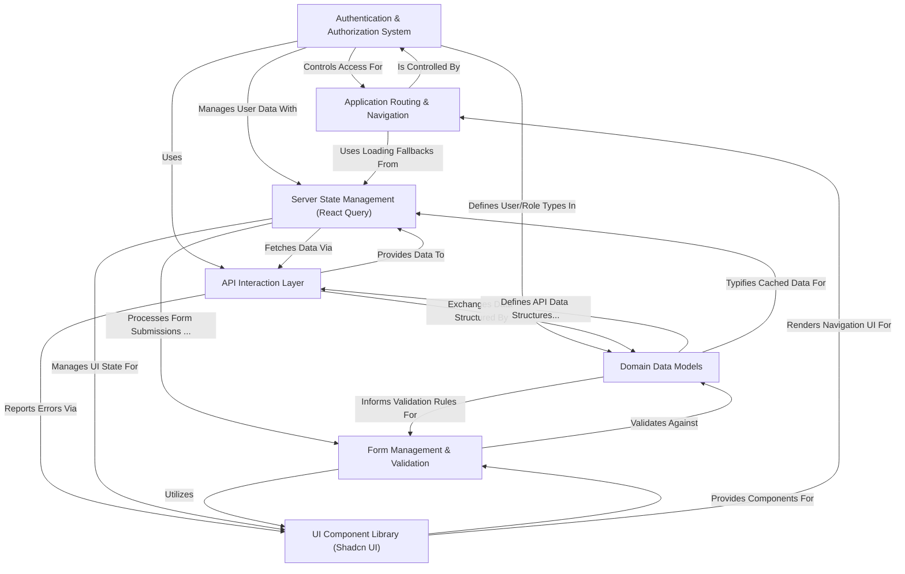

# Tutorial: CoursePalette

CoursePalette is an _e-learning platform_ that enables users to **discover and enroll in courses**.
It provides comprehensive tools for administrators and teachers to **manage courses, lessons, assignments, and user roles**, ensuring a structured and interactive learning experience.
Students can track their progress, earn certificates, and interact with the course content, all while the system handles secure **authentication, data management, and a consistent user interface**.

## Visual Overview

## Chapters

1. [Domain Data Models
   ](01_domain_data_models_.md)
2. [UI Component Library (Shadcn UI)
   ](02_ui_component_library__shadcn_ui__.md)
3. [Application Routing & Navigation
   ](03_application_routing___navigation_.md)
4. [Authentication & Authorization System
   ](04_authentication___authorization_system_.md)
5. [API Interaction Layer
   ](05_api_interaction_layer_.md)
6. [Server State Management (React Query)
   ](06_server_state_management__react_query__.md)
7. [Form Management & Validation
   ](07_form_management___validation_.md)
