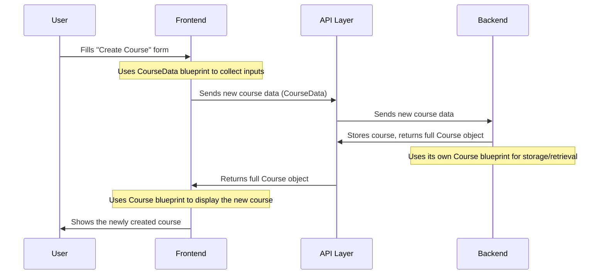

# Chapter 1: Domain Data Models

Welcome to CoursePalette! In this first chapter, we're going to dive into a core concept that helps us keep our application organized and easy to understand: **Domain Data Models**.

Imagine you're building with LEGOs. Before you start, you usually look at the instructions or have a clear idea of what each piece is and how it fits together, right? What if one person thinks a red brick is a car wheel, and another thinks it's a roof? Chaos!

In the world of software development, we deal with "data" instead of LEGO bricks. For our CoursePalette application, this data includes things like **Courses**, **Lessons**, **Users**, and **Assignments**. Just like with LEGOs, if different parts of our application (or different developers!) have different ideas about what a "Course" is, we'll run into problems.

This is where **Domain Data Models** come in. They are like the **blueprints or instruction manuals** for all the main pieces of information in CoursePalette. They answer questions like:

- What makes a "Course" a Course?
- What information does a "User" profile hold?
- What details do we need for a "Lesson"?

By defining these blueprints clearly, we ensure that everyone – from the part of the app that shows courses (the frontend) to the part that stores them (the backend) – speaks the same language about our data. This prevents confusion, makes our code more reliable, and helps us build new features faster.

---

### What are these "Blueprints" Made Of?

In programming, especially with a language like TypeScript (which CoursePalette uses), we define these blueprints using something called an `interface`. Think of an interface as a contract or a promise about what a piece of data will look like.

Let's take our central example: a **Course**. What information do we need to describe a course in CoursePalette?

- A **title** (like "Introduction to Web Development")
- A **description** (what the course is about)
- A **price** (how much it costs)
- A **level** (beginner, intermediate, advanced)
- And many more details!

Our Domain Data Model for a `Course` will list all these properties and what _type_ of information they are (e.g., text, numbers, true/false).

---

### Diving into a Course Blueprint

Let's look at a simplified example of how we might define a "Course" using a data model in CoursePalette. This particular blueprint, `CourseData`, is often used when we want to create a _new_ course and send its details to our backend system.

```typescript
// src/services/api/courseService.ts (simplified)

export interface CourseData {
  title: string; // The name of the course, e.g., "React Basics"
  description: string; // A detailed explanation of the course
  category_id: string; // Which category it belongs to (e.g., "Web Development")
  price: number; // How much the course costs
  level: string; // Difficulty level: "BEGINNER", "INTERMEDIATE"
  status: string; // Current status: "DRAFT", "PUBLISHED"
  language: string; // Language the course is taught in
  duration: number; // Total duration in hours or minutes
  skills: string[]; // List of skills learned, e.g., ["JavaScript", "HTML"]
  image?: File; // An optional image for the course
}
```

In this code snippet:

- `export interface CourseData { ... }` declares our `CourseData` blueprint.
- Each line inside (like `title: string;`) defines a piece of information, or "property," that a `CourseData` object must have.
- `title: string` means the `title` property must be a piece of text (a "string").
- `price: number` means `price` must be a number.
- `skills: string[]` means `skills` must be a list (an "array") of strings.
- `image?: File` means the `image` property is optional (the `?` makes it optional) and, if present, should be a `File` type.

This `CourseData` model is like a form you fill out to create a new course. It tells you exactly what information is needed and in what format.

---

### How Domain Data Models Work in CoursePalette

Let's trace a simple journey of data using our `CourseData` blueprint.

#### Step 1: Frontend (Your Browser) Gathers Information

Imagine you're an instructor using CoursePalette. You go to a "Create New Course" page. This page needs to collect information about your new course. It uses the `CourseData` blueprint to know what input fields to show (title, description, price, etc.) and what type of data to expect from you.

#### Step 2: Sending Data to the Backend (The Server)

Once you fill out the form and click "Save," your browser (the frontend) needs to send this course data to the CoursePalette server (the backend) to be stored. It packages up all the information according to the `CourseData` blueprint.

#### Step 3: Backend Processes and Stores Data

The CoursePalette server receives this data. Because it also understands the `CourseData` blueprint, it knows exactly how to read and store the `title`, `description`, `price`, and other details in its database.

#### Step 4: Backend Responds with a Complete Course

After successfully creating the course, the backend might send back a more complete "Course" object. This object will usually include things like a unique `id` for the course, timestamps for when it was created, and maybe even a list of lessons that belong to it. This response follows another `Course` blueprint, usually defined in `src/types/course.ts`:

```typescript
// src/types/course.ts (simplified)

export interface Course {
  id: string; // A unique identifier for the course
  title: string; // The course title
  description?: string; // Optional description
  instructor: string; // Name of the instructor
  image: string; // URL to the course image
  price: number;
  category: string;
  // ... many other properties that come from the server ...
  lessons?: Lesson[]; // A list of lessons in this course
  // ...
}
```

Notice how this `Course` interface is similar to `CourseData` but also adds an `id`, `instructor`, `image` (as a URL), and even a list of `lessons`. This is common – you often have slightly different "shapes" for data when you're _creating_ it versus when you're _viewing_ or _receiving_ it from the system.

Here's a simple diagram to visualize this flow:



You can see other examples of these data models throughout the CoursePalette project:

- `src/types/user.ts` defines what a `User` looks like.
- `src/types/category.ts` defines the structure of a `Category`.
- And many more in `src/types/course.ts` for things like `Lesson`, `Assignment`, `Resource`, etc.

### Why is this important for you?

As you contribute to CoursePalette, understanding these domain data models is crucial:

1.  **Consistency:** You'll know exactly what information to expect or provide for any given data type, whether you're working on displaying a course or submitting a user profile.
2.  **Fewer Errors:** If your code tries to use a "Course" without a `title` (when the blueprint says it must have one), TypeScript will warn you before you even run your code! This helps catch mistakes early.
3.  **Easier Collaboration:** Everyone working on CoursePalette knows the "rules" for the data, making it easier to work together.

Domain Data Models are the backbone of a well-structured application like CoursePalette. They bring clarity and order to our data, allowing us to build powerful features confidently.

---

### Conclusion

In this chapter, we learned that **Domain Data Models** are the essential blueprints for all the main data pieces in CoursePalette, like Courses, Users, and Lessons. They ensure consistency and prevent errors by defining what each piece of data looks like. We saw how `interface` in TypeScript helps us define these models and how they guide the flow of information between different parts of our application.

Next, we'll explore how we bring these data models to life visually using our user interface. Get ready to learn about designing and assembling the building blocks of our application's look and feel!

[Next Chapter: UI Component Library (Shadcn UI)](02_ui_component_library__shadcn_ui__.md)
