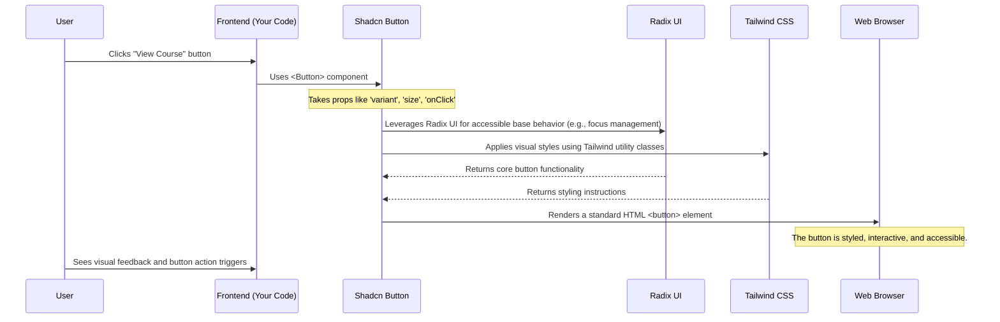

# Chapter 2: UI Component Library (Shadcn UI)

Welcome back to CoursePalette! In our [first chapter](01_domain_data_models_.md), we explored **Domain Data Models**, which are like the blueprints for the information our application uses. We learned how to define what a "Course" or a "User" looks like behind the scenes.

Now, let's bring those blueprints to life! Imagine you've designed a beautiful LEGO set, but you haven't actually built anything yet. That's where this chapter comes in. We're going to talk about how we build the actual visual parts of CoursePalette that users interact with.

### The Problem: Building Everything from Scratch is Hard

Think about making a website. You need buttons, text fields, cards to display information, navigation menus, and so much more. If you had to design and code every single one of these elements from scratch, it would be:

1.  **Time-consuming**: It takes ages to get every detail right.
2.  **Inconsistent**: Different parts of the app might look slightly different.
3.  **Buggy**: Every new component is a chance for new errors.
4.  **Not accessible**: Making sure every element works for everyone (e.g., keyboard navigation, screen readers) is a huge task.
5.  **Not responsive**: Ensuring it looks good on phones, tablets, and desktops is complex.

This is where a **UI Component Library** becomes incredibly useful.

### The Solution: Pre-built LEGO Bricks for Your UI

A UI Component Library is like a toolkit of pre-built, beautifully designed, and functional LEGO bricks for your application's user interface. Instead of designing every button, input field, or card from scratch, developers use these standardized components.

In CoursePalette, we use **Shadcn UI** as our UI component library.

#### What is Shadcn UI?

Shadcn UI isn't a traditional library you install and then can't change. Instead, it's a collection of _reusable code snippets_ that get added directly into your project. This means:

- **You own the code**: You have full control over how each component looks and behaves.
- **Highly customizable**: You can tweak them to fit CoursePalette's specific design without fighting the library.
- **Built with modern tools**: It uses [Tailwind CSS](https://tailwindcss.com/) for styling (we'll see more on this) and [Radix UI](https://www.radix-ui.com/) for accessibility and component behavior.
- **Fast development**: You use components that are already styled, responsive, and accessible out-of-the-box.

### Our Use Case: Displaying Course Information

Let's say we want to show a list of courses (the `Course` data from Chapter 1). For each course, we need a visual block that displays its title, a short description, its level, and a button to view more details. This is a perfect job for UI components!

We'll use components like `Card`, `CardHeader`, `CardTitle`, `CardContent`, `Badge`, and `Button` from Shadcn UI to build each course display.

### How to Use Shadcn UI Components in CoursePalette

In CoursePalette, many of the Shadcn UI components are imported and re-exported from a central file, `src/components/index.ts`. This makes it super easy to bring them into your code.

Let's look at a simplified example of how we might create a `CourseCard` component using Shadcn UI's "LEGO bricks":

```typescript
// src/components/CourseCard.tsx (simplified example)
import {
  Badge,
  Button,
  Card,
  CardContent,
  CardHeader,
  CardTitle,
} from "@/components"; // Import from our centralized components file

// Imagine CourseData is similar to what we defined in Chapter 1
interface CourseData {
  title: string;
  description: string;
  level: string; // e.g., "BEGINNER", "INTERMEDIATE"
  price: number;
}

interface CourseCardProps {
  course: CourseData;
}

function CourseCard({ course }: CourseCardProps) {
  return (
    // Card component acts as a container for the course info
    <Card className="w-[300px]">
      <CardHeader>
        {/* CardTitle displays the course name */}
        <CardTitle>{course.title}</CardTitle>
        {/* Badge component shows the course level */}
        <Badge>{course.level}</Badge>
      </CardHeader>
      <CardContent>
        {/* Paragraph for the description */}
        <p className="text-sm text-muted-foreground mb-4">
          {course.description.substring(0, 70)}...{" "}
          {/* Show a truncated description */}
        </p>
        {/* Button to view the course, styled by Shadcn UI */}
        <Button className="w-full">View Course (${course.price})</Button>
      </CardContent>
    </Card>
  );
}

export default CourseCard;
```

In this `CourseCard` component:

- We import several components like `Card`, `CardHeader`, `CardTitle`, `CardContent`, `Badge`, and `Button` from `@/components`. This `index.ts` file acts as a convenient shortcut to all our essential UI components.
- The `<Card>` component wraps everything, giving it a nice border and shadow. The `className="w-[300px]"` is a [Tailwind CSS](https://tailwindcss.com/) utility class that sets the width.
- `<CardHeader>` and `<CardContent>` help organize the content inside the card.
- `<CardTitle>` ensures the title is displayed with the correct heading styles.
- `<Badge>` is a small label, perfect for showing the course level.
- `<Button>` is a pre-styled, interactive button. Notice how we just provide the text, and it looks great without extra CSS! The `className="w-full"` makes it take up the full width of its parent.

When you use this `CourseCard` component in your application, it will render a visually consistent, well-styled, and functional card, thanks to Shadcn UI.

### Under the Hood: How Shadcn UI Components Work

Let's peel back a layer and see what makes these components tick, using the `Button` as our example.

Imagine a user interacts with a button on the CoursePalette website:



This diagram shows that when you use a `<Button>`, it's not just a simple HTML `<button>` tag. Shadcn UI wraps the basic HTML element with:

1.  **Accessibility features from Radix UI**: This ensures the button works well for all users, including those using assistive technologies.
2.  **Styling powered by Tailwind CSS**: This gives the button its look and feel (colors, padding, rounded corners, hover effects, etc.).

Let's briefly look at the actual code for the `Button` component in CoursePalette:

```typescript
// src/components/ui/button.tsx (simplified)
import { cva } from "class-variance-authority"; // Helps create variants
import { cn } from "@/lib/utils"; // Utility to combine Tailwind classes

const buttonVariants = cva(
  "inline-flex items-center justify-center ...", // Default styles
  {
    variants: {
      variant: {
        // Different styles based on "variant" prop
        default: "bg-primary text-primary-foreground ...",
        destructive: "bg-destructive text-destructive-foreground ...",
        // ... more variants
      },
      size: {
        // Different styles based on "size" prop
        default: "h-10 px-4 py-2",
        sm: "h-9 rounded-md px-3",
        // ... more sizes
      },
    },
    defaultVariants: {
      // What to use if no variant/size is specified
      variant: "default",
      size: "default",
    },
  }
);

export interface ButtonProps
  extends React.ButtonHTMLAttributes<HTMLButtonElement> {
  variant?:
    | "default"
    | "destructive"
    | "outline"
    | "secondary"
    | "ghost"
    | "link";
  size?: "default" | "sm" | "lg" | "icon";
  asChild?: boolean; // Radix UI prop
}

const Button = React.forwardRef<HTMLButtonElement, ButtonProps>(
  ({ className, variant, size, asChild = false, ...props }, ref) => {
    const Comp = asChild ? Slot : "button"; // Slot is from Radix UI for flexibility
    return (
      <Comp
        className={cn(buttonVariants({ variant, size, className }))} // Apply styles
        ref={ref}
        {...props}
      />
    );
  }
);
Button.displayName = "Button";

export { Button, buttonVariants };
```

Here's a breakdown of the important parts:

- `cva`: This function (`class-variance-authority`) is a powerful tool used to define different visual "variants" and "sizes" for a component. For our `Button`, it means we can easily have `variant="destructive"` for a red button or `size="sm"` for a smaller button, all with predefined styles.
- `cn`: This is a helper function (defined in `src/lib/utils.ts`) that intelligently combines Tailwind CSS classes. It ensures that custom classes you provide (via the `className` prop) merge correctly with the component's default styles.
- `buttonVariants({ variant, size, className })`: This is where `cva` is used. It generates a single string of Tailwind CSS classes based on the `variant`, `size`, and any additional `className` you pass.
- The `tailwind.config.ts` file is where all the color variables (like `--primary`, `--destructive`), spacing, and other design tokens are defined, making it easy to change CoursePalette's look and feel globally. These variables are then used in `src/index.css` to define the actual colors.

The `Card` component works similarly, defining its base styles and how `CardHeader`, `CardTitle`, and `CardContent` should be structured.

```typescript
// src/components/ui/card.tsx (simplified)
import * as React from "react";
import { cn } from "@/lib/utils"; // For combining Tailwind classes

const Card = React.forwardRef<
  HTMLDivElement,
  React.HTMLAttributes<HTMLDivElement>
>(({ className, ...props }, ref) => (
  <div
    ref={ref}
    className={cn(
      "rounded-lg border bg-card text-card-foreground shadow-sm", // Default Card styles
      className
    )}
    {...props}
  />
));
Card.displayName = "Card";

const CardHeader = React.forwardRef<
  HTMLDivElement,
  React.HTMLAttributes<HTMLDivElement>
>(({ className, ...props }, ref) => (
  <div
    ref={ref}
    className={cn("flex flex-col space-y-1.5 p-6", className)} // Default Header styles
    {...props}
  />
));
CardHeader.displayName = "CardHeader";

// ... CardTitle, CardContent, etc. follow a similar pattern
```

You can see that each Shadcn UI component is essentially a small React component that combines basic HTML elements with powerful styling (`cn`) and smart variant management (`cva`). This approach gives CoursePalette a highly consistent, customizable, and maintainable user interface.

### Why is this important for you?

- **Speed**: You can build new features and pages much faster by assembling pre-built components.
- **Consistency**: All parts of CoursePalette will have a uniform look and feel because they share the same underlying components and styling system.
- **Quality**: Components are designed to be responsive, accessible, and follow best practices, reducing the chance of UI bugs.
- **Customization**: If you ever need to change the look of a button or card across the entire application, you modify the core component file or the Tailwind configuration, and the changes apply everywhere.

Shadcn UI empowers us to focus on the unique features of CoursePalette, rather than spending time re-inventing basic UI elements.

---

### Conclusion

In this chapter, we learned that a **UI Component Library** like **Shadcn UI** provides a powerful toolkit of pre-built, customizable "LEGO bricks" for building CoursePalette's user interface. We saw how these components ensure consistency, speed up development, and make our application responsive and accessible. We also got a peek under the hood to understand how components like `Button` and `Card` use Tailwind CSS and Radix UI to achieve their polished look and behavior.

Now that we know how to define our data and display it with beautiful components, the next step is to understand how users move between different parts of our application.

[Next Chapter: Application Routing & Navigation](03_application_routing___navigation_.md)
