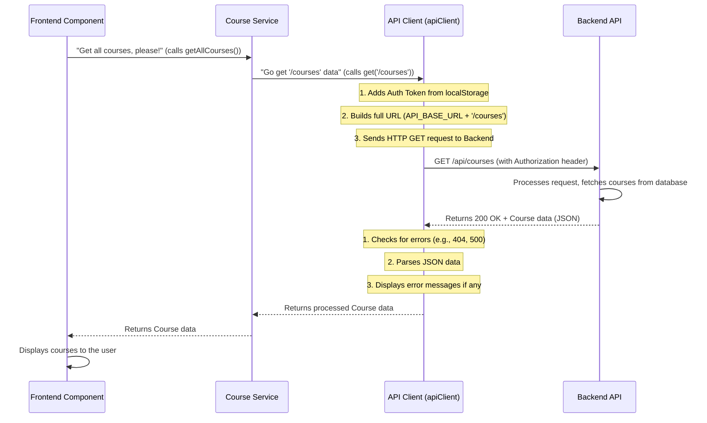

# Chapter 5: API Interaction Layer

Welcome back, CoursePalette explorers! In our [previous chapter: Authentication & Authorization System](04_authentication___authorization_system__.md), we learned how CoursePalette identifies users and controls what they're allowed to see and do. Now that we know who's allowed in and what their "permissions" are, how does our frontend application (what you see in your browser) actually talk to the backend server (where all the data is stored and processed) to get or send information?

Imagine our CoursePalette application is like a customer in a restaurant. The customer (your browser) wants to order food (get course data) or pay the bill (submit assignment data). The kitchen (our backend server) has all the ingredients and cooks the food. But how does the order get from the customer to the kitchen, and the food get from the kitchen to the customer? You need a **waiter**!

This "waiter" in our software world is what we call the **API Interaction Layer**.

### The Problem: Frontend and Backend Don't Talk Directly

Our beautiful user interface (built with Shadcn UI from [Chapter 2: UI Component Library (Shadcn UI)](02_ui_component_library__shadcn_ui__.md)) can display information, but it doesn't _store_ any course details or user profiles itself. All that crucial data lives on our backend server.

Without a dedicated communication channel, it would be messy:

- **How do we ask for data?** Do we just shout at the server?
- **How do we send data?** What format should it be in?
- **What if something goes wrong?** How do we know if the server understood us, or if there was an error?
- **How do we prove who we are?** (Related to [Chapter 4: Authentication & Authorization System](04_authentication___authorization_system__.md)) We need to send our "ID" with every request.

This is where the **API Interaction Layer** steps in!

### The Solution: A Dedicated Communication Channel

The API Interaction Layer is like CoursePalette's dedicated communication specialist. It handles all the back-and-forth between your browser and our server.

Here's what it does:

1.  **Sends Requests:** It packages up your "orders" (like "get me all courses" or "create a new assignment") and sends them to the server.
2.  **Receives Responses:** It listens for the server's "reply" (like the list of courses or a confirmation that an assignment was created).
3.  **Ensures Correct Format:** It makes sure the "order slip" is written in a language both the frontend and backend understand (usually **JSON**).
4.  **Manages Common Tasks:** It automatically adds your "loyalty card" (your **authorization token** from [Chapter 4: Authentication & Authorization System](04_authentication___authorization_system__.md)) to secure requests. It also gracefully handles "kitchen errors" (API errors), showing you helpful messages instead of confusing technical jargon.

### Key Concepts: Talking to the Server

Let's break down the core ideas of how our frontend talks to the backend:

| Concept            | What it Means                                                                                                                                                                                  | Analogy                                         |
| :----------------- | :--------------------------------------------------------------------------------------------------------------------------------------------------------------------------------------------- | :---------------------------------------------- |
| **API**            | **A**pplication **P**rogramming **I**nterface – A set of rules and tools for different software programs to communicate. It's like the restaurant's menu: it lists what you can order and how. | Restaurant Menu                                 |
| **Request**        | An instruction sent from the frontend to the backend (e.g., "get courses").                                                                                                                    | Placing an order with the waiter                |
| **Response**       | The data or confirmation sent back from the backend to the frontend (e.g., a list of courses).                                                                                                 | The waiter bringing your food                   |
| **HTTP Methods**   | Different types of requests (GET for getting data, POST for sending new data, PUT for updating, DELETE for removing).                                                                          | "Bring me," "Make me," "Change my," "Remove my" |
| **JSON**           | **J**ava**S**cript **O**bject **N**otation – A common, human-readable format for sending data between systems.                                                                                 | A standard, clear order slip                    |
| **Authorization**  | Including proof of identity (like a token) with your request so the server knows who you are and what you're allowed to do.                                                                    | Showing your ID or loyalty card to the waiter   |
| **Error Handling** | What happens if the server can't fulfill your request (e.g., data not found, permission denied).                                                                                               | The waiter telling you an item is unavailable   |

### Our Use Case: Fetching a List of Courses

Let's bring this to life with a concrete example. On the CoursePalette `/courses` page, we need to show a list of all available courses.

Here's how we'd use the API Interaction Layer to do that:

```typescript
// src/pages/public/courses/CoursesPage.tsx (simplified)
import { courseService } from "@/services/api/courseService"; // Our API "waiter" for courses

// ... inside a React component or hook ...
async function fetchAllCourses() {
  try {
    // This is the magic! We just ask the courseService for all courses.
    const courses = await courseService.getAllCourses();
    console.log("Successfully fetched courses:", courses);
    // Now you can display these courses in your UI!
  } catch (error) {
    console.error("Failed to fetch courses:", error);
    // An error message would already be displayed to the user by apiClient
  }
}

// Call this function when the page loads, for example
// fetchAllCourses();
```

See how simple that looks? From the perspective of our `CoursesPage` component, we just `await courseService.getAllCourses()`, and the `courses` magically appear (or an error is handled). Our component doesn't need to worry about:

- Which URL to call (`/api/courses`)
- Adding `Authorization` headers
- Converting the response from text to a JavaScript object
- Checking for different error codes

All of that complexity is handled by our API Interaction Layer!

### Under the Hood: The API Communication Flow

Let's see what truly happens when `courseService.getAllCourses()` is called:



This diagram shows that the `API Client` (our `apiClient` function) is the central piece of our "waiter" service. Let's look at the actual code that makes this happen.

#### 1. The Core `apiClient` (`src/services/api/apiClient.ts`)

This file contains the brain of our API Interaction Layer. It's a single function, `apiClient`, that all other services use.

```typescript
// src/services/api/apiClient.ts (simplified)
import { toast } from '@/hooks/use-toast'; // For showing error messages

export const API_BASE_URL =
  import.meta.env.VITE_API_BASE_URL || 'http://localhost:8000/api';

// Helper to get authentication token from local storage
export const getAuthToken = (): string | null => {
  const user = localStorage.getItem('user'); // Look for 'user' data
  if (user) {
    const parsedUser = JSON.parse(user);
    return parsedUser.token || null; // Return the token if found
  }
  return null;
};

export const apiClient = async (
  endpoint: string,
  method: string = 'GET',
  data?: any,
  options: any = {}
) => {
  let url = `${API_BASE_URL}${endpoint}`; // Combine base URL with specific path

  const headers: Record<string, string> = {
    'Content-Type': 'application/json', // Tell server we're sending JSON
    ...(options.headers || {}),
  };

  const token = options.token || getAuthToken(); // Get our authorization token
  if (token) {
    headers['Authorization'] = `Bearer ${token}`; // Add token to request headers
  }

  const requestOptions: RequestInit = {
    method,
    headers,
  };

  // If sending data, prepare it for non-GET requests
  if (method !== 'GET' && data) {
    if (data instanceof FormData) { // Special handling for file uploads
      delete headers['Content-Type']; // Browser sets this automatically for FormData
      requestOptions.body = data;
    } else {
      requestOptions.body = JSON.stringify(data); // Convert JS object to JSON string
    }
  }

  try {
    const response = await fetch(url, requestOptions); // Send the request!

    if (!response.ok) { // If the server sent an error response (e.g., 404, 500)
      const errorData = await response.json().catch(() => ({}));
      const errorMessage = errorData.message || `Error: ${response.status}`;
      toast({ title: 'API Error', description: errorMessage, variant: 'destructive' });
      throw new Error(errorMessage);
    }

    // If successful, parse the response data…
```
